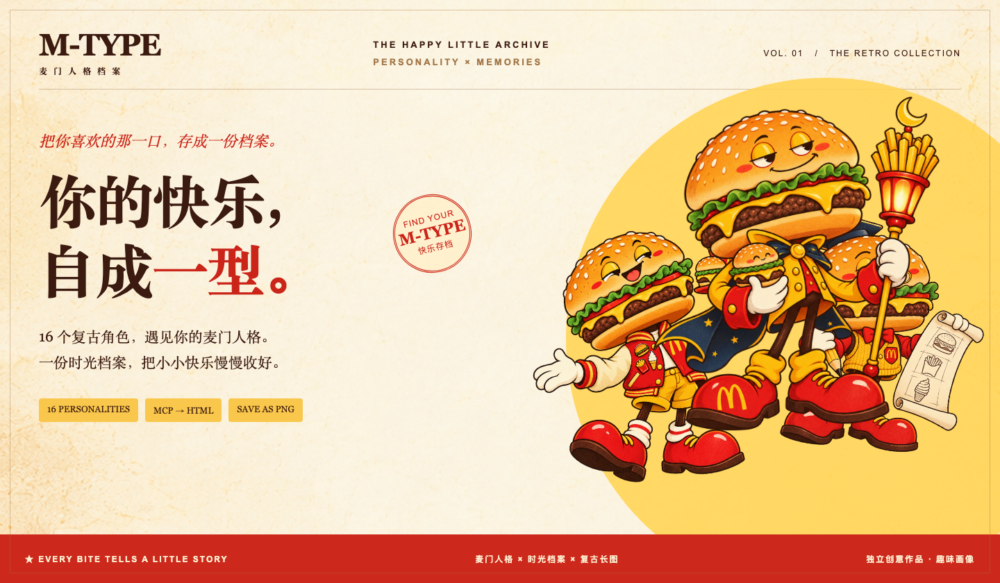
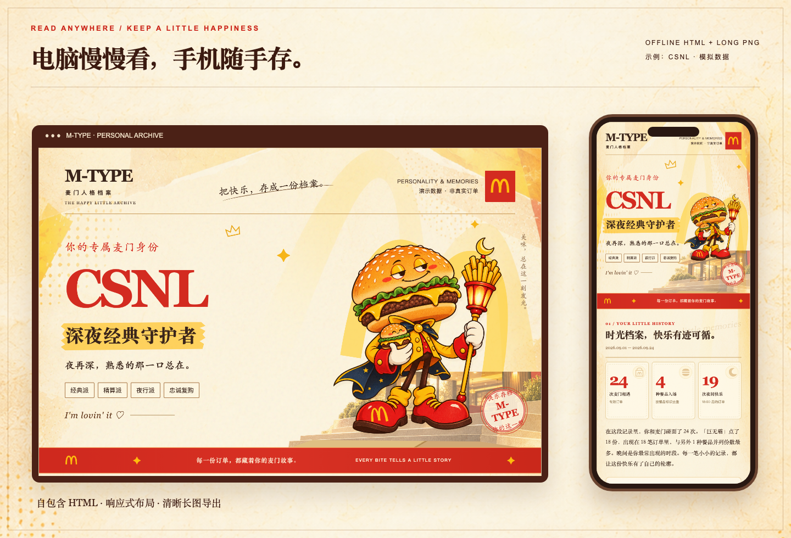

<p align="center">
  
</p>

<h1 align="center">M-TYPE · 麦门人格档案</h1>

<p align="center"><strong>把你喜欢的那一口，存成一份麦门档案。</strong><br>16 个复古角色 × 你的点餐偏好 × 一份可以收藏的时光报告</p>

<p align="center">
  
  
  
  
</p>

<p align="center">
  <a href="#一句话交给你的-agent">一句话安装</a> ·
  <a href="https://github.com/shianlab/m-type/releases/tag/v0.3.0">下载 Skill</a> ·
  <a href="docs/SHOWCASE.md">4 个完整案例</a> ·
  <a href="docs/PERSONALITIES.md">16 型图鉴</a> ·
  <a href="docs/DEVELOPMENT.md">开发与构建</a>
</p>

---

M-TYPE 是一个可交给 Agent 使用的 Skill：连接麦当劳官方 MCP，读取这次可获取的消费记录，匹配你的复古麦门人格，再生成餐品偏爱、点餐时段和几个快乐停靠点。模板与角色已经预制，使用时只替换人格、数据和有依据的文案。

**当前为公开预览版。** 本地安装包、离线 HTML、手机／电脑 PNG 已验证；WorkBuddy、Codex 的原生安装与 MCP 全流程仍待实测。下方案例全部采用模拟数据。

## 目标用户

适合希望了解自己的点餐偏好、收藏消费回忆的麦当劳用户，以及希望通过 Agent 生成个人报告的用户。近期没有可获取记录时，也可以通过偏好问答获得趣味人格，历史档案保持留白。

## 参赛材料

本项目参加[麦当劳程序员创意开发大赛](https://github.com/M-China/mcd-developer-innovation-challenge)。审核材料位于仓库根目录：

- [参赛声明（CONTEST_DECLARATION.md）](CONTEST_DECLARATION.md)：使用官方原文。
- [MCP 接入说明（MCP_INTEGRATION.md）](MCP_INTEGRATION.md)：服务、工具、调用流程、业务价值及实测边界。
- [脱敏 MCP 配置示例（mcp-config.example.json）](mcp-config.example.json)：凭证仅使用环境变量占位符，使用限制见 MCP 接入说明。

项目代码与素材说明见 [NOTICE.md](NOTICE.md)；安装方法与使用示例见下文。

## 一句话，交给你的 Agent

复制这一句给 WorkBuddy、Codex，或具备 Skill、文件执行和 MCP 能力的 Agent：

```text
请从 https://github.com/shianlab/m-type 安装「麦门人格档案」Skill：先阅读 INSTALL.md，下载 v0.3.0 Release 的完整 Skill 安装包，按当前 Agent 的方式安装并自检，再引导我连接麦当劳官方 MCP，生成我的麦门人格与时光档案。
```

安装后，只需说：

```text
生成我的麦门人格档案。
```

也可以说 `先看演示档案` 或 `检查麦当劳连接`。首次登录和填写 Token 由本人完成；已有有效连接时，直接继续查询。逐端安装说明见 [INSTALL.md](INSTALL.md)。

<p align="center"><a href="https://github.com/shianlab/m-type/releases/download/v0.3.0/m-type-0.3.0.zip"><strong>下载完整 Skill ZIP</strong></a> &nbsp;·&nbsp; <a href="https://github.com/shianlab/m-type/releases/download/v0.3.0/SHA256SUMS">校验文件</a> &nbsp;·&nbsp; <a href="https://github.com/shianlab/m-type/releases/download/v0.3.0/m-type-demo-cases-0.3.0.zip">下载 4 个离线案例</a></p>

> 安装用 Release 中的 `m-type-0.3.0.zip`。GitHub 自动生成的 Source code ZIP 和仓库中的 `skill/m-type/` 是源码，尚需构建装配完整运行文件。

## 一次点餐，一点偏爱，一份档案

| 麦门人格 | 时光档案 | 收藏方式 |
| --- | --- | --- |
| 16 张透明复古角色，按四维偏好匹配 | 有效记录、餐品排行、时段分布、时间线 | 可离线打开的 HTML，手机与电脑长图 |
| 数据足够时由记录判断，不足时仅补问缺失偏好 | 未知信息保持未知，无记录时历史留白 | 无需生成图片 API，素材随包提供 |



## 四个案例，四种快乐的样子


| 模拟案例 | 记录与侧重 | 人格来源 | 查看完整长图 |
| --- | --- | --- | --- |
| **CSNL · 深夜经典守护者** | 24 笔、4 种餐品；19 笔在 18:00 后 | 模拟订单 | [长图](docs/images/night-guardian-mobile.png) · [案例说明](docs/SHOWCASE.md#01--深夜经典守护者) |
| **CSDV · 白日菜单研究员** | 10 笔、10 种餐品；白日与菜单变化 | 模拟订单 | [长图](docs/images/day-researcher-mobile.png) · [案例说明](docs/SHOWCASE.md#02--白日菜单研究员) |
| **EFDV · 全能麦门体验官** | 16 笔、12 种餐品；随心尝鲜 | 模拟订单 | [长图](docs/images/sunshine-explorer-mobile.png) · [案例说明](docs/SHOWCASE.md#03--全能麦门体验官) |
| **EFNV · 午夜麦门探索者** | 0 笔；无记录时的偏好问答 | 模拟回答 | [长图](docs/images/empty-with-answers-mobile.png) · [案例说明](docs/SHOWCASE.md#04--午夜麦门探索者) |

每个案例都有对应输入 JSON，可以重新生成。案例中的商品标签、优惠与记录均为合成演示信息，不能作为真实商品目录或账号历史。完整 HTML、电脑 PNG、手机 PNG 已放入 [案例下载包](https://github.com/shianlab/m-type/releases/download/v0.3.0/m-type-demo-cases-0.3.0.zip)。

## 十六种快乐，各有自己的形状


所有角色均为 **1254 × 1254 的透明 PNG**，带金拱门细节；纸张拼贴、门店场景与食物装饰一起随 Skill 提供。查看 [16 型名称、宣言与独立图片](docs/PERSONALITIES.md)，或下载 [16 型交互演示 HTML](https://github.com/shianlab/m-type/releases/download/v0.3.0/m-type-character-gallery.html) 离线切换角色。

| 四个维度 | 两种倾向 |
| --- | --- |
| 口味 | **C** 经典偏爱 / **E** 探索尝鲜 |
| 选择 | **S** 优惠与规划 / **F** 随心选择 |
| 时段 | **D** 18:00 前 / **N** 18:00 及之后 |
| 菜单 | **L** 固定复购 / **V** 多样组合 |

这是趣味消费画像。报告会展示结论来自订单还是补充回答；具体规则与并列处理见 [生成入口与数据说明](docs/PHASE-1-生成入口.md)。

## 从安装到收下档案

> 安装 Skill → 连接官方 MCP → 读取可获取记录 → 必要时补问偏好 → 匹配复古人格 → 生成 HTML 与长图

1. **安装。** 把一句话交给 Agent，或下载完整 ZIP，通过宿主的本地技能入口导入。
2. **连接。** 在[麦当劳官方 MCP 平台](https://open.mcd.cn/mcp)登录并申请 Token，填入 Agent 的凭证入口。
3. **生成。** Agent 读取必要记录，补齐缺失偏好，生成属于你的角色和报告。
4. **收藏。** 电脑打开 HTML，手机阅读长图，也可以在 HTML 中点击“保存长图”。

## 运行与适配状态

| 能力 | 当前结果 |
| --- | --- |
| 独立目录安装与重复安装 | 已验证；有本地修改时保留原文件 |
| Node 20+ 离线 HTML | 已验证；完整包无需 npm 安装即可生成 |
| 手机／电脑 PNG | 已验证；需要可用的 Playwright / Chromium，或在浏览器手动保存 |
| 320 / 390 / 1280 宽度布局 | 已验证 |
| 官方 MCP 握手与只读查询 | 开发客户端已实测，成功但本次未返回列表 |
| 非空真实订单字段与完整报告 | 待真实样本核验 |
| WorkBuddy / Codex 原生安装、触发与 MCP 联动 | 待客户端实测，现有接入说明可供试用 |

实测说明见 [Skill 封装与验证](docs/PHASE-3-Skill封装.md) 和 [MCP 联调记录](docs/PHASE-2-MCP联调.md)。

<details>
<summary><strong>最近没有消费，也能得到人格吗？</strong></summary>

可以。只补问缺失的口味、优惠、时段与菜单偏好，得到问答人格；时光档案保持为空。接口未返回列表不意味着终身零订单，报告会注明这次实际取得的数据范围。

</details>

<details>
<summary><strong>需要自己做图片，或另配生图 API 吗？</strong></summary>

不需要。16 个角色和 8 个背景／装饰已经装进完整 Skill。每次生成都使用固定的复古模板和对应透明角色。HTML 需要 Node 20+，自动 PNG 另外需要浏览器运行时。

</details>

<details>
<summary><strong>消费记录与 Token 会去哪里？</strong></summary>

由你使用的 Agent 调用麦当劳官方 MCP，并在本地生成报告。本项目没有收集订单的公共代理服务器；模型如何处理 MCP 响应取决于所选 Agent 的设置。Token 填入宿主凭证入口，不发送到聊天；成品排除地址、手机号、支付链接和完整订单号，金额默认隐藏。

</details>

<details>
<summary><strong>为什么自动 PNG 没生成，HTML 仍然能用？</strong></summary>

完整 HTML 已嵌入角色、背景、统计和导出组件。自动 PNG 依赖可用浏览器；导出失败会保留 HTML 并明确返回部分完成状态。打开 HTML 后仍可点击“保存长图”，或者准备好浏览器后单独重试导出。

</details>

## 构建与复现

```sh
git clone https://github.com/shianlab/m-type.git
cd m-type
npm ci
npm run render -- --input examples/day-researcher.json --out output/my-report
```

```sh
# 构建完整 Skill 安装包
npm run package:skill

# 逻辑与安装包验证
npm test
npm run test:skill

# 重建 4 个案例与 README 展示图（需 Chromium）
npx --no-install playwright install chromium
npm run showcase
npm run package:cases
```

更多开发命令、输入格式、固定模板和 MCP 契约见 [开发文档](docs/DEVELOPMENT.md)。

---

<p align="center"><strong>EVERY BITE TELLS A LITTLE STORY.</strong><br>独立开发创意作品 · 非麦当劳官方产品 · 趣味消费画像<br>第三方组件、素材及品牌说明见 <a href="NOTICE.md">NOTICE.md</a>。</p>
