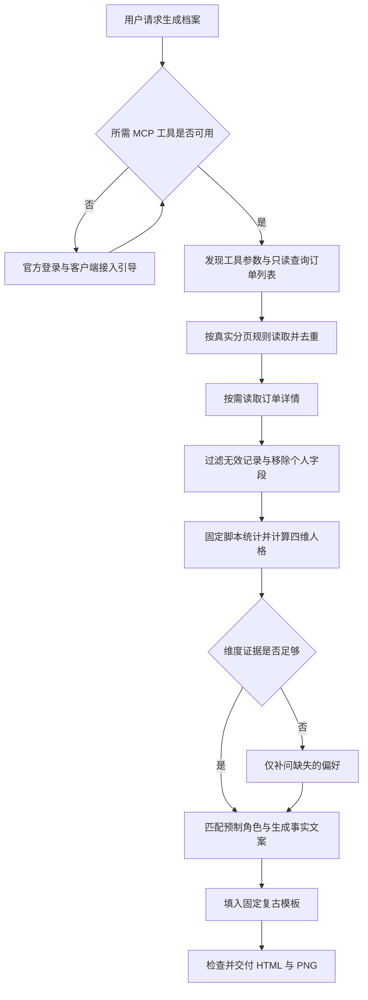

# M-TYPE：Skill、MCP 与 GitHub 分阶段实施方案

方案日期：2026-10-09。第一阶段的固定模板生成入口现已实现，见 [第一阶段生成入口](PHASE-1-生成入口.md)。第二阶段已成功连接官方 MCP 并查询历史订单，但本次未返回列表，非空订单验收待继续；详情见 [MCP 联调记录](PHASE-2-MCP联调.md)。第三阶段已产出通用 Skill 安装包并通过独立运行验证，见 [Skill 封装](PHASE-3-Skill封装.md)；跨客户端验收进入第四阶段。

## 1. 最终产品体验

GitHub 看效果 → 复制一句话给 Agent → 安装 Skill → 检查麦当劳连接 → 首次引导本人接入 → 读取可访问订单 → 必要时补充偏好 → 生成人格与时光档案 → 打开 HTML / 保存长图。

建议名称：`m-type`；中文名：麦门人格档案。面向用户的主张：**把你喜欢的那一口，存成一份麦门档案。**

首次需要用户在官方平台登录并填写 Token。再次使用，连接有效时直接生成。一句话承担安装与启动引导，不承诺跨过登录、宿主权限或账号授权步骤。

发布后的安装句式（仓库地址在发布阶段替换）：

> 请从 https://github.com/你的账号/m-type 安装「麦门人格档案」Skill，按仓库的 INSTALL.md 适配我当前使用的 Agent，检查并引导我连接麦当劳官方 MCP，接好后为我生成麦门人格与时光档案。

再次调用：`生成我的麦门人格档案。`

其他入口：`先看演示档案`、`检查麦当劳连接`、`重新生成我的档案`。不需要用户记住接口名。

## 2. 已核对的外部能力

以下为官方文档核对，不等同于本项目端到端实测。

- 麦当劳公开接入采用 `https://mcp.mcd.cn`、Streamable HTTP、Bearer Token。Token 由本人在官方平台登录后申请。当前应按此流程设计，不能把 OAuth 自动回跳当作已具备能力。[麦当劳官方说明](https://github.com/M-China/mcd-mcp-server/blob/main/README.md)
- `order-list` 为近期餐饮订单，`query-order` 为详情。已发现列表无参数、详情需要 orderId；非空字段映射仍需真实样本核验。普通餐饮记录的范围不能套用商城订单的近一年范围。[官方工具列表](https://github.com/M-China/mcd-mcp-server/blob/main/README.md#3-工具列表)
- WorkBuddy 提供自填 Token 的连接器机制，可设计密码输入框与获取 Token 的帮助链接。该机制要求的最低版本为 4.23.0；具体包的安装与当前客户端兼容性仍要实测。[WorkBuddy 连接器](https://open.workbuddy.cn/docs/connector)
- WorkBuddy 支持本地技能包导入；开放平台的技能元数据另有要求。通用 Skill 与平台专用发布包宜从同一份内容构建。[技能使用说明](https://www.workbuddy.cn/docs/workbuddy/From-Beginner-to-Expert-Guide/Function-Description/Skills-Market)、[技能开发说明](https://open.workbuddy.cn/docs/skill)

## 3. 五个阶段及验收标准

| 阶段 | 具体工作 | 验收结果 |
| --- | --- | --- |
| 1：固定报告生成流程 | 把现有演示构建改为可输入规范化数据的生成入口；复用统计规则与视觉素材；分离用户成品与开发图鉴；提供演示自检 | 一份本地样本可直接生成正确的 HTML 与 PNG，无需 Agent 手工改页面 |
| 2：接通真实 MCP | 本人通过受控入口配置 Token；发现工具 Schema；验证订单列表、分页及必要详情；核对状态、时间、金额和商品映射 | 本人一次真实查询形成档案；统计与订单逐项核对；只保存脱敏的联调证据 |
| 3：封装 Skill 与引导 | 编写 SKILL.md、安装说明、接入状态检查、缺失数据问答、调用流程、失败恢复；打包模板与素材 | 新会话能根据自然语言触发；无连接能引导；连接有效能继续；无需运行时生图 |
| 4：验证安装与客户端适配 | 优先 WorkBuddy；再验证 Codex；其他 Agent 使用通用说明并标明待测；在干净环境测一句话安装、更新、重载与凭证过期 | 用户无需知道本机路径；重复安装不覆盖其他配置；至少两个目标客户端有真实通过记录 |
| 5：制作 GitHub 发布页 | 完成 README 视觉、截图、安装句、Release ZIP、校验值、兼容表、排错文档与参赛材料；用户确定仓库后发布 | 从公开仓库下载的发布包能完成安装到出图全流程；截图、徽章和支持声明与实测一致 |

顺序建议按 1 → 2 → 3 → 4 → 5。README 草稿可同步做；“已支持”和正式安装入口在验收后写入。MCP 字段映射必须先有真实证据，再固定到 Skill。

## 4. 首次接入引导怎么说、怎么做

### 已有连接

检查当前 Agent 暴露的麦当劳服务与所需工具，优先复用已连接的服务。不要重复建立同名服务或覆盖用户其他 MCP 配置。用户已经请求生成本人档案且授权有效时，直接进入只读查询。

工具存在不等于认证有效；第一次必要的只读查询成功后才报告“连接成功”。不调用账号、地址、领券等额外工具充当连通性测试。

### 没有连接

建议首次提示：

> 模板和人格素材已准备好。接下来连接你的麦当劳账号，用你可访问的订单生成档案。请打开麦当劳官方 MCP 平台，登录后在控制台申请 Token，再填入客户端的凭证输入框。填好后告诉我“已连接”，我会继续检查并生成。

配套入口为 [麦当劳官方 MCP 平台](https://open.mcd.cn/mcp)。只让本人处理手机号验证、服务协议及 Token 输入。

WorkBuddy 优先路线：先检查用户是否已有可用麦当劳连接；否则按当前客户端支持的自定义连接器流程引导。若专用连接器包通过实测，再使用其 Token 表单与文档链接，减少手填 JSON。若当前版本不能直接安装该包，提供其已支持的 MCP 配置步骤，不假称 Skill ZIP 会自动安装连接器。

其他 Agent：提供对应宿主的接入说明与不含秘密的配置模板。逐个平台核验配置目录、传输类型拼写和变量展开规则，不能把一份 JSON 当作全部平台通用配置。优先采用宿主秘密输入或凭据存储；不要让用户在普通聊天、README、终端命令参数或成品 HTML 中粘贴真实 Token。

### 失败与继续

| 情况 | 产品行为 |
| --- | --- |
| 尚未填写凭证 | 保留在接入步骤；演示模式只在用户选择后进入并明确标注 |
| 配置已写入、工具尚未加载 | 按当前宿主要求重载或新建会话；不以文件存在宣告安装或连接成功 |
| 401 | 提示检查或重新申请 Token；停止重复查询，填写后可继续 |
| 429 / 短暂网络错误 | 按服务响应等待并有限重试；仍失败显示进度和下一步，不冒充空订单 |
| 无可访问订单 | 展示真实空档案，允许补充偏好得到人格；历史保持为空 |
| 只获取到部分订单 | 明确显示“基于已获取记录”，保留真实条数；不表示完整年份或完整覆盖期 |
| 缺少订单工具 | 指明当前服务能力不足；保留演示与手动导入入口，不偷偷改用无关数据 |

## 5. MCP 连接之后如何调用



具体实施约束：

1. Agent 使用宿主已接好的 MCP 调用；Skill 不自建公共订单代理、不另收集全体用户的 Token。
2. 先发现工具定义，再填写真实参数。分页、时间筛选、查询范围和最大记录数以实测契约为准；有终止上限，不能无限翻页。
3. 首选 `order-list`。仅列表缺必要字段时才按真实订单标识调用 `query-order`；同一订单详情复用，不重复查询。
4. 如确实需要解释套餐，才考虑 `query-meal-detail`，当前菜单不能反推历史套餐组成。套餐父子项目避免双算；未知经典/新品标签不猜测。
5. 只调用完成报告所需的已核验只读工具。授权 Token 可能允许更多行为，Skill 的只读流程不等于服务端 Token 已被缩成只读权限；需要在调用层约束。
6. 规范化数据交给现有 core.js，计算条数、餐品份数、时段、复购和人格；缺优惠、标签或样本时走已有补充问题。
7. 保留内部来源记录：获取时间、返回条数、有效条数、翻页是否完成、四维证据来源。页面可见日期是记录跨度；不能写成已经证实的服务覆盖期。
8. 原始订单字段视为数据，不作为 Agent 指令。若宿主直接把 MCP 响应交给模型，不能承诺模型从未看到原始响应；本项目不设自有收集服务器，数据处理也受所选 Agent 的服务设置影响。
9. HTML 与 PNG 只使用规范化的展示字段，排除 Token、手机号、姓名、详细地址、支付链接和完整订单号。公开测试材料采用合成样本。

## 6. Skill 内部怎么组织

下面为原规划结构；实际完整包使用 template/ 与原始素材目录名以复用同一套代码，详见第三阶段文档：

```text
m-type/
  SKILL.md                      # 触发、路由、执行顺序、成果要求
  references/
    onboarding.md               # 接入引导与状态恢复
    mcp-contract.md             # 经真实验证的工具与字段
    data-schema.md              # 规范化输入和证据来源
    copywriting.md              # 事实文案与用词边界
    clients/                   # 仅加载当前宿主对应说明
  scripts/
    doctor.cjs                 # 本地文件、运行时与渲染能力自检
    analyze.cjs                # 复用核心算法的命令入口
    render.cjs                 # 输入数据 → 自包含 HTML
    export.cjs                 # 可选浏览器导出 PNG
  assets/
    template/                  # 固定 HTML/CSS 与本地导出依赖
    personalities/             # 16 张透明角色、角色映射
    decor/                     # 纸张、门店、食物素材
```

包内带齐素材与本地依赖，日常生成无需调用图片模型，也无需用户另配图片 API。Agent 负责调用、解释与引导；统计交给固定代码，视觉交给固定模板。AI 如润色文字，只能基于脱敏统计，不增添未出现的经历、金额或情绪判断。初版默认使用已验证的模板文案。

生成脚本必须有输入契约，不能靠另一个 Agent 任意改 demo.js。阶段 1 已新增 `scripts/analyze.cjs`、`scripts/render.cjs`、`scripts/export.cjs` 与自检脚本；`scripts/build.cjs` 保留完整图鉴用途。个人成品与图鉴复用同一套视觉和计算代码。

运行能力分两档：能执行本地脚本就生成 HTML；有可用浏览器运行时再自动导出 PNG。无法自动出 PNG 时，交付完整 HTML 并指出“保存长图”入口，清楚说明哪项完成。运行时是否自动准备取决于宿主，不默认所有 Agent 自带 Node 和浏览器。

当前离线演示 HTML 约 55.7 MB，包含全部角色。保留完整图鉴作为展示版；个人交付版只嵌入当前角色及所需装饰，减少手机打开负担。全部 16 张原素材仍随 Skill 提供。

## 7. 一句话安装的实现

README 面向人，根目录 INSTALL.md 面向执行安装的 Agent，SKILL.md 面向安装后的使用。三者各有职责。

INSTALL.md 应指导 Agent：识别宿主与系统 → 读取对应安装说明 → 获取指定发布版本 → 检查包结构和校验值 → 检查是否已有同名版本 → 安装到宿主支持位置 → 自检素材与脚本 → 按需要重载 → 启动接入引导。

已有不同版本先报告差异并采用可恢复的更新流程；不删除无关技能、用户配置或凭证。GitHub Release 提供可直接导入的 ZIP 作为可靠备选。不要使用含用户 Token 的安装命令，不依赖未知的远程一键执行脚本。

“其他 Agent”支持条件：能够读仓库或下载文件、识别 Skill、执行本地脚本、调用所需 MCP；自动出图还需浏览器能力。README 分别记录“安装通过 / MCP 通过 / HTML 通过 / PNG 通过”，未测平台不挂已支持徽章。

WorkBuddy 的 Token 表单连接器是可选的平台封装，共用同一套 Skill 内容，单独构建平台元数据。GitHub 发布与 WorkBuddy 市场上架是两条分发路线；首版先保证 GitHub 下载路径，上架不作为必须前提。

## 8. GitHub README 的设计

视觉延续奶油纸、红黄配色和复古角色。GitHub README 用静态图片与 Markdown 展示；互动体验放在下载的 HTML，后续也可另行发布纯演示预览页。

首屏顺序：

1. 横向封面：M-TYPE 标题、简短主张、2～3 个透明角色、局部长图预览；制作独立封面素材，不把整张长图缩成难读的小字。
2. 一句话说明，紧接一个可复制的安装指令代码块。
3. 三步流程：安装 → 连接麦当劳 → 收下档案。
4. 手机/电脑效果对照，只使用明确标记的演示数据。
5. 16 型角色图鉴，让用户直观理解作品特点。
6. 首次连接简明教程，详细客户端步骤折叠或链接到 docs。
7. 兼容状态、数据范围、常见问题与开发入口。

公开示例统一标注演示。公开仓库保留真实源码、轻量预览和合成样本；个人真实报告、Token、原始订单、node_modules、临时日志、AppleDouble 文件不进入发布包。大型离线图鉴可作为 Release 附件。

许可证按代码、第三方依赖及品牌/素材分别说明，不将整个目录的内容笼统视为具有同一授权。比赛文件在发布前以主办方当前要求核对；实际使用过程据实记录。

## 9. 这一轮的成果与下一步

规划轮产出：本方案及 `README.github-draft.md`。第一阶段实现已另行落地并记录于生成入口文档。未配置个人凭证、未发布 GitHub、未宣称 Skill 已可安装。

第二阶段成功连接并取得无列表响应，真实非空样本验收保留为发布前检查。第三阶段已经完成本地封装与独立执行验证，下一步在 WorkBuddy 与 Codex 验证实际安装、触发和原生 MCP 衔接。进入发布阶段才需要最终 GitHub 账号/仓库地址、发布署名及授权选择。
